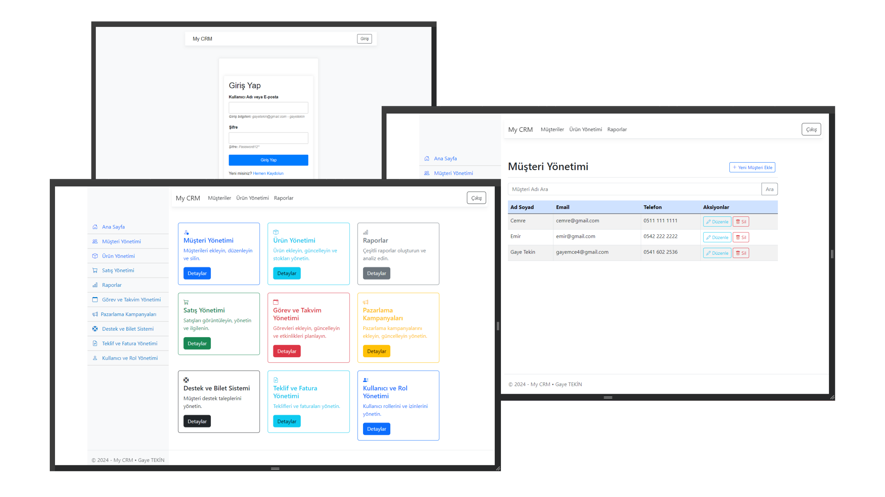

# CRM Project

CRM Projesi, .NET 7 teknolojisi kullanılarak geliştirilmiş bir web uygulamasıdır. Bu proje, kullanıcılara müşteri yönetimi, ürün yönetimi yapabilme özellikleri sunmaktadır.

## Kullanılan Teknolojiler

- **Backend İçin Kullanılan Teknolojiler**
  - .NET 7
  - Identity Kütüphanesi
  - FluentValidation
  - Entity Framework (Code First)
  - Repository Pattern
  - CQRS Pattern
 
- **Frontend İçin Kullanılan Teknolojiler**
  - Bootstrap

## Proje Görseli

